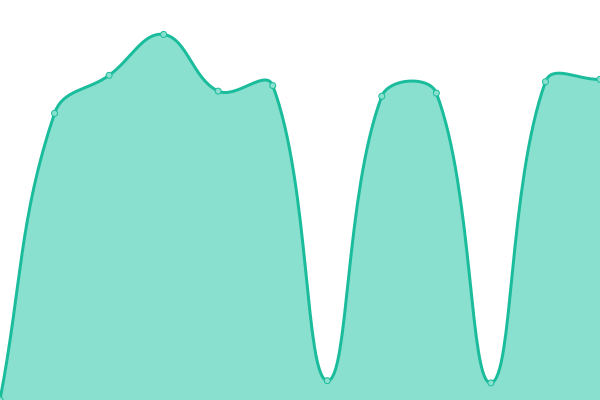

# [📈 Live Status](https://status.piped.shimul.me): <!--live status--> **🟧 Partial outage**

This repository contains the open-source uptime monitor and status page for [Shimul](https://status.piped.shimul.me), powered by [Upptime](https://github.com/upptime/upptime).

With [Upptime](https://upptime.js.org), you can get your own unlimited and free uptime monitor and status page, powered entirely by a GitHub repository. We use [Issues](https://github.com/shimuldn/status-piped/issues) as incident reports, [Actions](https://github.com/shimuldn/status-piped/actions) as uptime monitors, and [Pages](https://status.piped.shimul.me) for the status page.

<!--start: status pages-->
<!-- This summary is generated by Upptime (https://github.com/upptime/upptime) -->
<!-- Do not edit this manually, your changes will be overwritten -->
<!-- prettier-ignore -->
| URL | Status | History | Response Time | Uptime |
| --- | ------ | ------- | ------------- | ------ |
|  [Piped API - Public](https://api-piped.shimul.me/trending) | 🟩 Up | [piped-api-public.yml](https://github.com/shimuldn/status-piped/commits/HEAD/history/piped-api-public.yml) | 

 854ms
     
 | 

<a href="https://status.piped.shimul.me/history/piped-api-public">100.00%</a>
    

|  [Piped Proxy - Public](http://proxy-piped.shimul.me) | 🟩 Up | [piped-proxy-public.yml](https://github.com/shimuldn/status-piped/commits/HEAD/history/piped-proxy-public.yml) | 

 1234ms
     
 | 

<a href="https://status.piped.shimul.me/history/piped-proxy-public">100.00%</a>
    

|  [Piped US - Public](http://us-piped.shimul.me) | 🟩 Up | [piped-us-public.yml](https://github.com/shimuldn/status-piped/commits/HEAD/history/piped-us-public.yml) | 

 655ms
     
 | 

<a href="https://status.piped.shimul.me/history/piped-us-public">100.00%</a>
    

|  [Piped US API - Public](https://us-api-piped.shimul.me/trending) | 🟩 Up | [piped-us-api-public.yml](https://github.com/shimuldn/status-piped/commits/HEAD/history/piped-us-api-public.yml) | 

 462ms
     
 | 

<a href="https://status.piped.shimul.me/history/piped-us-api-public">100.00%</a>
    

|  [Piped US Proxy - Public](http://us-proxy-piped.shimul.me) | 🟩 Up | [piped-us-proxy-public.yml](https://github.com/shimuldn/status-piped/commits/HEAD/history/piped-us-proxy-public.yml) | 

 642ms
     
 | 

<a href="https://status.piped.shimul.me/history/piped-us-proxy-public">100.00%</a>
    

|  [Piped DE - Public](http://de-piped.shimul.me) | 🟩 Up | [piped-de-public.yml](https://github.com/shimuldn/status-piped/commits/HEAD/history/piped-de-public.yml) | 

 560ms
     
 | 

<a href="https://status.piped.shimul.me/history/piped-de-public">100.00%</a>
    

|  [Piped DE API - Public](https://de-api-piped.shimul.me/trending) | 🟩 Up | [piped-de-api-public.yml](https://github.com/shimuldn/status-piped/commits/HEAD/history/piped-de-api-public.yml) | 

 337ms
     
 | 

<a href="https://status.piped.shimul.me/history/piped-de-api-public">100.00%</a>
    

|  [Piped DE Proxy - Public](http://de-proxy-piped.shimul.me) | 🟩 Up | [piped-de-proxy-public.yml](https://github.com/shimuldn/status-piped/commits/HEAD/history/piped-de-proxy-public.yml) | 

 542ms
     
 | 

<a href="https://status.piped.shimul.me/history/piped-de-proxy-public">100.00%</a>
    

|  [Piped SA - Public](http://sa-piped.shimul.me) | 🟥 Down | [piped-sa-public.yml](https://github.com/shimuldn/status-piped/commits/HEAD/history/piped-sa-public.yml) | 

 900ms
     
 | 

<a href="https://status.piped.shimul.me/history/piped-sa-public">6.70%</a>
    

|  [Piped SA API - Public](https://sa-api-piped.shimul.me/trending) | 🟥 Down | [piped-sa-api-public.yml](https://github.com/shimuldn/status-piped/commits/HEAD/history/piped-sa-api-public.yml) | 

 513ms
     
 | 

<a href="https://status.piped.shimul.me/history/piped-sa-api-public">3.62%</a>
    

|  [Piped SA Proxy - Public](http://sa-proxy-piped.shimul.me) | 🟥 Down | [piped-sa-proxy-public.yml](https://github.com/shimuldn/status-piped/commits/HEAD/history/piped-sa-proxy-public.yml) | 

 876ms
     
 | 

<a href="https://status.piped.shimul.me/history/piped-sa-proxy-public">11.25%</a>
    

|  [Piped IN - Public](http://in-piped.shimul.me) | 🟩 Up | [piped-in-public.yml](https://github.com/shimuldn/status-piped/commits/HEAD/history/piped-in-public.yml) | 

 1695ms
     
 | 

<a href="https://status.piped.shimul.me/history/piped-in-public">100.00%</a>
    

|  [Piped In API - Public](https://in-api-piped.shimul.me/trending) | 🟩 Up | [piped-in-api-public.yml](https://github.com/shimuldn/status-piped/commits/HEAD/history/piped-in-api-public.yml) | 

 1000ms
     
 | 

<a href="https://status.piped.shimul.me/history/piped-in-api-public">100.00%</a>
    

|  [Piped IN Proxy - Public](http://in-proxy-piped.shimul.me) | 🟩 Up | [piped-in-proxy-public.yml](https://github.com/shimuldn/status-piped/commits/HEAD/history/piped-in-proxy-public.yml) | 

 1670ms
     
 | 

<a href="https://status.piped.shimul.me/history/piped-in-proxy-public">100.00%</a>
    

<!--end: status pages-->

[**Visit our status website →**](https://status.piped.shimul.me)

## 📄 License

- Powered by: [Upptime](https://github.com/upptime/upptime)
- Code: [MIT](./LICENSE) © [Shimul](https://status.piped.shimul.me)
- Data in the `./history` directory: [Open Database License](https://opendatacommons.org/licenses/odbl/1-0/)
